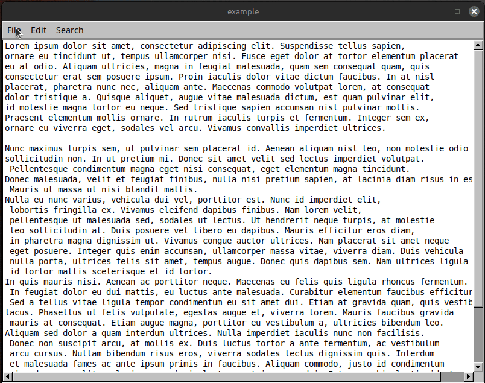

# FLTK Text Editor  
*A lightweight, cross-platform text editor built with C++ and FLTK.*  

##  Description  
A minimal GUI text editor written in C++ using the **FLTK (Fast Light Toolkit)**. Designed for plain text editing with essential features like:  
- File operations (New, Open, Save)  
- Edit commands (Cut, Copy, Paste, Undo)  
- Search & Replace dialogs  
- Multi-window support for the same document  
- Insert File command  
- Basic change tracking for unsaved edits  

##  Features  
- **Cross-platform** (Windows, Linux, macOS)  
- **Lightweight** (No bloat, just text editing)  
- **Multi-Window Support** Edit the same file in multiple views  
- **Basic Undo** Revert recent changes  
- **Insert File** Embed contents of another file  

##  Technologies Used  
- **C++** (Core logic and UI)  
- **FLTK** (GUI toolkit for windows, buttons, menus, and dialogs)  
- **Standard Libraries**  
  - `<stdio.h>` (File I/O)  
  - `<string.h>` (String handling)  
  - `<FL/fl_ask.H>` (Alert dialogs)  

##  Known Limitations  
- **Basic text-only** – No rich text, tabs, or spell-check.  
- **Single-level undo** – No redo or undo history.  
- **No large file support** – Avoid opening huge/non-text files.  
